# SAGE-Kit

[English](README.md) | [中文](README.zh-CN.md)

[](https://github.com/JoeKeepGo/SAGE-Kit/actions/workflows/sagekit-self-check.yml)
[](https://github.com/JoeKeepGo/SAGE-Kit/releases)
[](LICENSE)

SAGE-Kit is a model-native SPEC and Harness framework for long-running,
agent-assisted product development. It keeps product authority, execution,
evidence, review, and acceptance distinct without placing another runtime
between the model and the project.

SAGE-Kit has no CLI, package runtime, daemon, scheduler, or hidden validator.
Models follow the project's current authority and SPEC, use the project's own
tools, and let the project's CI verify the final candidate.

## Core Workflow

```mermaid
flowchart LR
  A["Idea and product authority"] --> B["Blueprint and roadmap"]
  B --> C["Milestone / Wave / Phase / Lane"]
  C --> D["Bounded plan or optional Graph"]
  D --> E["Implementation loop"]
  E --> F["Project-native focused checks"]
  F --> G["Risk-based independent review"]
  G --> H["Required final project CI"]
  H --> I["Human acceptance and closeout"]
```



The loop does the work. The optional Graph makes dependencies, joins, gates,
and parallelism explicit when that structure improves a decision. Light work
does not need a Graph.

## Quick Adoption

Install the Skill once, bootstrap each project, and then work normally:

1. Install or reference [`skills/sage-kit`](skills/sage-kit) through the host's
   Skill mechanism.
2. Add the lightweight project entry from the
   [`AGENTS.md` bootstrap template](docs/templates/AGENTS_SAGE_BOOTSTRAP_TEMPLATE.md)
   and point it to current project authority. Claude Code projects use a
   `CLAUDE.md` that imports the bootstrap; see the host references.
3. Let automatic project instructions handle Light work. Standard or Heavy
   work and acceptance, review, corrective, or release tasks implicitly load
   the complete Skill once.
4. Use explicit `$sage-kit` invocation to override or diagnose routing. It is
   only the required fallback when a host has neither automatic project
   instructions nor implicit Skill invocation.
5. Keep project-native focused checks and run final CI only when the project,
   merge, release, or acceptance gate requires it.

Start with [`SAGE_CORE.md`](docs/SAGE_CORE.md),
[`AGENT_HARNESS.md`](docs/agent/AGENT_HARNESS.md), and the reusable
[`templates`](docs/templates).

## Governance Levels

| Level | Use it for | Typical shape |
|---|---|---|
| Light | Small, low-risk, bounded changes | 0-1 docs, controller may execute, no independent review by default, 1-2 focused checks; CI only for a project/merge/release gate |
| Standard | Normal multi-file product work | Short plan + result, risk-based controller/subagents, one affected review, focused checks and required CI per unchanged candidate |
| Heavy | Concrete safety, authority, production, release, destructive, or broad integration risk | 3-5 purposeful docs by default, one independent final review, risk checks + project-required final CI when selected, explicit high-risk human gates |

Governance level and permission are independent. A Heavy controller does not
automatically receive write, corrective, submit, or acceptance authority.

## What Remains Authoritative

- The project owns product requirements, threat model, scope, permissions,
  gates, tests, and acceptance.
- Git, runtimes, checks, reviews, and artifacts own the facts they expose;
  project documents own intent and decisions. `ACTIVE_CONTEXT` is a compact
  handoff snapshot, not a second source of machine truth.
- Capability realization and evidence trust are owned by
  [`CLAIM_EVIDENCE_TRUST.md`](docs/agent/CLAIM_EVIDENCE_TRUST.md); other
  surfaces link to it instead of duplicating the model.
- [`contracts`](contracts) contains optional static, language-neutral Graph and
  Node Result schemas. Contract presence never executes work or grants
  authority.
- [`docs`](docs) contains the governance model and planning templates.
- [`skills/sage-kit`](skills/sage-kit) activates and routes the model-native
  workflow for supported hosts.

## Supported Hosts

The Skill includes guidance for Codex, Claude Code, OpenCode, and Kimi. Codex,
Kimi Code CLI, and OpenCode support project `AGENTS.md`; Claude Code uses
`CLAUDE.md` and can import that bootstrap. These instruction channels and
implicit Skill routing guide the model but do not create hard enforcement.
SAGE-Kit can coexist with specialist Skills, plugins, MCP tools, native
subagents, and project-specific automation. Those capabilities remain subject
to project authority and must not silently broaden scope.

Cross-milestone continuation depends on the host and is bounded to already
admitted, preauthorized milestones. The coordinator records authority,
admissions, completion/next-admission rules, drift, resume, handoff, and
convergence. Stop for product acceptance, scope/permission expansion, a new
threat-model decision, destructive/production work, credentials, merge, or
release. Explicit project authority may allow `DONE_PENDING_ACCEPTANCE` to
continue within the admitted envelope.

## Verification Economy

```text
each change       -> project-native focused check
affected boundary -> affected-only review or verification
unchanged inputs  -> reuse attributable evidence
final candidate   -> required project CI once per unchanged candidate
finding fixed     -> targeted re-review, not full review replay
```

Progress may continue while findings converge and scope stays fixed. The same
root cause with no progress in two consecutive rounds under the same existing
corrective authority stops the loop; no fresh PM approval is required per round.
Ordinary wording, EOF, and non-semantic consistency issues are corrected
directly when ownership is clear.

## Repository Layout

```text
contracts/          Optional machine-readable static contracts
docs/               Canonical governance docs, profiles, and templates
skills/sage-kit/    Model activation and host routing
scripts/            Lightweight repository-integrity checks
tests/              Shell/PowerShell tests for shipped host hooks
```

For migration from the former executable line, see the
[`model-native migration guide`](docs/MIGRATION_MODEL_NATIVE.md).

## Fit

SAGE-Kit is useful when work spans sessions, milestones, people, or agents and
when authority, evidence, and completion must stay auditable. A short script or
disposable prototype usually needs less structure.
