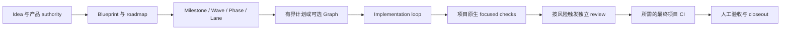

# SAGE-Kit

[English](README.md) | [中文](README.zh-CN.md)

[](https://github.com/JoeKeepGo/SAGE-Kit/actions/workflows/sagekit-self-check.yml)
[](https://github.com/JoeKeepGo/SAGE-Kit/releases)
[](LICENSE)

SAGE-Kit 是面向长期 Agent 协作产品开发的模型原生 SPEC 与 Harness 框架。它区分
产品权威、执行、证据、审查与验收，但不再在模型和项目之间增加另一套运行时。

SAGE-Kit 没有 CLI、package runtime、daemon、scheduler 或隐藏 validator。模型读取
项目当前 authority 与 SPEC，直接使用项目原生工具，并由项目 CI 验证最终候选。

## 核心流程



Loop 负责推进工作；Graph 只在依赖、join、gate 或并行关系能改善决策时启用。
Light 工作不强制使用 Graph。

## 快速接入

Skill 安装一次，每个项目完成一次 bootstrap，之后直接按正常方式工作：

1. 通过宿主的 Skill 机制引用或安装 [`skills/sage-kit`](skills/sage-kit)。
2. 使用 [`AGENTS.md` bootstrap 模板](docs/templates/AGENTS_SAGE_BOOTSTRAP_TEMPLATE.md)
   添加轻量项目入口，并指向当前项目 authority。Claude Code 项目使用导入该
   bootstrap 的 `CLAUDE.md`；具体见宿主 reference。
3. Light 工作（包括 Light review 与机械式 corrective）由自动项目指令携带 kernel；
   Standard/Heavy、实质语义 review/corrective、acceptance 与 release 在每个 controller
   context 加载一次完整 Skill。
4. 当 adoption、当前 authority 或所需 Skill 内容无法解析时，使用显式 `$sage-kit`
   覆盖或诊断路由。
5. 实现期间使用项目原生 focused checks；只有项目、merge、release 或 acceptance
   gate 要求时才运行最终 CI。

建议从 [`SAGE_CORE.md`](docs/SAGE_CORE.md)、
[`AGENT_HARNESS.md`](docs/agent/AGENT_HARNESS.md) 和
[`templates`](docs/templates) 开始。

## 治理等级

| 等级 | 适用工作 | 常见结构 |
|---|---|---|
| Light | 小型、低风险、边界明确的修改 | 0-1 个文档，controller 可执行，默认无独立 review，1-2 个 focused checks；只有项目/merge/release gate 要求时运行 CI |
| Standard | 普通多文件产品工作 | 短 plan + result，按风险使用 controller/subagents，一次 affected review，focused checks，以及仅在项目 authority、acceptance 或 merge/release gate 要求时对每个未变候选运行一次项目 CI |
| Heavy | 具体安全、权限、生产、发布、破坏性或广泛集成风险 | 默认 3-5 个有目的文档，一次独立 final review，risk checks + 仅在项目明确选择时执行 final CI，显式高风险人工 gates |

治理等级与权限彼此独立。Heavy controller 不会自动获得写入、corrective、submit
或 acceptance authority。

## 权威边界

- active SPEC 与项目 authority 拥有规范性 objective、产品 intent、acceptance criteria
  和 acceptance decision。
- Git、runtime、checks、reviews 与 artifacts 拥有各自直接观测的事实；
  `ACTIVE_CONTEXT` 只拥有紧凑的 status/findings/blockers/next-action snapshot 及其
  references，不拥有 intent，也不是第二个机器事实来源。
- capability realization 与 evidence trust 统一由
  [`CLAIM_EVIDENCE_TRUST.md`](docs/agent/CLAIM_EVIDENCE_TRUST.md) 管理；其他表面只链接，
  不复制模型全文。
- [`contracts`](contracts) 提供可选、静态、语言无关的 Graph 与 Node Result
  schema。合同存在不会执行任务或授予权限。
- [`docs`](docs) 保存治理模型与规划模板。
- [`skills/sage-kit`](skills/sage-kit) 为各宿主激活并路由模型原生工作流。

## 支持的宿主

Skill 包含 Codex、Claude Code、OpenCode 和 Kimi 指导。项目指令与 Skill 路由是预期
宿主能力，应根据已采用的宿主版本和配置确认；它们用于指导模型，不构成 hard
enforcement。SAGE-Kit 可与
specialist Skills、plugins、MCP、原生 subagents 及项目自动化共存；所有能力仍受项目
authority 约束，不得静默扩张范围。

跨 Milestone 继续执行依赖宿主，且只限已纳入并预授权的 milestone。协调 envelope
记录 authority、admission、完成/下一 admission、drift、resume、handoff 与 convergence。
产品验收、范围/权限扩张、新 threat-model 决策、破坏性/生产操作、凭据、merge 或
release 必须停止。只有项目 authority 明确允许时，`DONE_PENDING_ACCEPTANCE` 才可在
已纳入范围内继续。

## 验证经济性

```text
每次修改       -> 项目原生 focused check
受影响边界     -> affected-only review 或 verification
输入未变化     -> 复用可归因 evidence
相关输入变化   -> 重跑受影响的 product/package/E2E proof
最终候选       -> 每个未变候选运行一次所需项目 CI
finding 已修复 -> targeted re-review，不重放 full review
```

当 finding 持续收敛且范围不扩张时可以自动继续；在同一既有 corrective authority
下，同一根因连续两轮无进展才停止，无需每轮重新取得 PM 批准。所有权明确的普通
wording、EOF 和非语义一致性问题直接修正。

## 仓库结构

```text
contracts/          可选机器可读静态合同
docs/               唯一治理文档、profiles 与 templates
skills/sage-kit/    模型激活与宿主路由
scripts/            轻量仓库完整性检查
tests/              已发布宿主 hooks 的 Shell/PowerShell 测试
```

从旧可执行版本线迁移时，参见
[`模型原生迁移指南`](docs/MIGRATION_MODEL_NATIVE.md)。

## 适用场景

SAGE-Kit 适合跨 Session、Milestone、人员或 Agent 的长期工作，以及必须审计
authority、evidence 与 completion 的项目。短脚本和一次性原型通常不需要这套结构。
